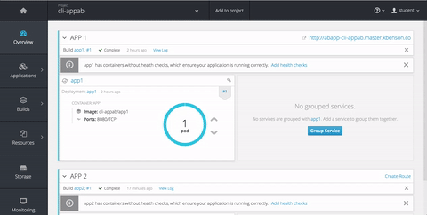

### What's A/B Testing?

A/B testing is **NOT** blue-green deployments. A/B testing is a way of testing features in your application for various reasons like usability, popularity, noticeability, etc, and how those factors influence the bottom line. It’s usually associated with UI parts of the app, but of course the backend services need to be available to do this. You can implement this with application-level switches (ie, smart logic that knows when to display certain UI controls), static switches (in the application), and also using Canary releases (as discussed below).

 

The difference between blue-green deployments and A/B testing is A/B testing is for measuring functionality in the app. Blue-green deployments is about releasing new software safely and rolling back predictably. You can obviously combine them: use blue-green deployments to deploy new features in an app that can be used for A/B testing.

### Let's Try It!
This demo will show how to use OpenShift's built in HAProxy capabilities to load balance across two Node.js apps.

Create basic node.js web app w/ git repo from a previous commit.

    oc new-app https://github.com/kyle-benson/ocp-nodejs-demo.git#b69a1b0f0c3195baa0dbd2ff600f8bebc38c7ade --name='appa'

:warning: Do not create a route automatically for this exercise.

Create a route to the deployed application.

    oc expose svc/appa --name="appab" --hostname=appab.

Begin using `curl` against the newly exposed route.

    while true; do curl appab-balanced.master.kbenson.co && echo && sleep 5; done

:information_source: Keep this command alive (it'll be used later on in this lab).

Update the current Route's annotation.

    oc get routes
    oc annotate route/appab haproxy.router.openshift.io/balance=roundrobin

Create second nodejs app from new branch or updated commit.

    oc new-app https://github.com/kyle-benson/ocp-nodejs-demo.git --name="app2"

Setup route to load balance between `appA` & `appB`.

> **Routes** > **Edit** > **Split Traffic**.

  

Observe the previous started while loop, notice anything different?
